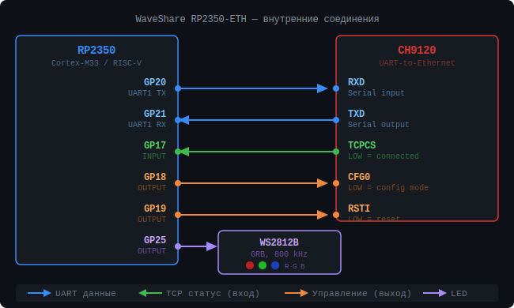

# RP2350-ETH MSC → TCP Streaming Bridge

Прошивка для [WaveShare RP2350-ETH](https://www.waveshare.com/wiki/RP2350-ETH).
Плата эмулирует USB-флешку (FAT12 128 KB), хост пишет `.txt` строки в файл — прошивка читает их в реальном времени и отправляет на TCP-сервер.

## Назначение

Устройство для хостов, которые умеют только записывать файл на USB-накопитель, но не имеют прямого сетевого стека. Плата прозрачно стримит данные в TCP — строка за строкой, без накопления файла целиком.

```
Хост (USB MSC)                RP2350-ETH                    Сервер (LAN)
──────────────                ──────────                    ────────────
пишет строки   ──USB MSC──►  FAT12 RAM-диск  ──TCP:2000──► принимает строки
в .txt файл                  (STREAMING)                   в реальном времени
```

**Задержка:** ~155 мс от записи на диск до TCP RECV.
**Пропускная способность:** ~130 пакетов/мин → disk reset каждые ~37 минут.

## Железо

| Компонент | Описание |
|-----------|----------|
| MCU | RP2350, dual-core Arm Cortex-M33 / RISC-V, 150 MHz |
| RAM | 520 KB SRAM (128 KB под FAT12-диск) |
| Flash | 4 MB |
| Ethernet | CH9120 (10M, UART-to-TCP/UDP) |
| USB | USB 2.0 Full Speed (TinyUSB MSC) |
| LED | WS2812B RGB (GP25, GRB) |

## Внутренние соединения RP2350 ↔ CH9120



> Все GPIO (GP17–GP21, GP25) используются **внутри платы** и на внешние разъёмы не выведены.

| GPIO RP2350 | Пин CH9120 | Направление | Описание |
|-------------|------------|-------------|----------|
| GP20 | RXD | RP2350 → CH9120 | UART1 TX — данные в CH9120 |
| GP21 | TXD | RP2350 ← CH9120 | UART1 RX — данные из CH9120 |
| GP17 | TCPCS | RP2350 ← CH9120 | LOW = TCP-соединение установлено |
| GP18 | CFG0  | RP2350 → CH9120 | LOW = режим конфигурации |
| GP19 | RSTI  | RP2350 → CH9120 | LOW = аппаратный сброс |

## Алгоритм работы

```
Boot
 │
 ├─ CH9120 настраивается как TCP client → SERVER_IP:SERVER_PORT (сохр. в EEPROM)
 ├─ USB MSC монтируется как диск (128 KB FAT12)
 ├─ LED: 3 белые вспышки
 │
 └─ IDLE ─── ждём файл на диске
      │        LED: медленно синий (TCP OK) / медленно красный (нет TCP)
      │
      │  Хост создаёт output_data/wc/EVERY_*.txt и начинает писать строки
      ▼
    STREAMING ─── прошивка читает новые строки по мере записи
      │             LED: быстро зелёный
      │
      │  Каждые WRITE_IDLE_MS=150 мс тишины → читаем новые данные → TCP
      │
      │  Нет новых данных > STREAM_IDLE_RESET_MS=5000 мс
      │  (хост закончил сессию или диск заполнился)
      ▼
    DISK RESET ─── disk_init() + media-change уведомление хосту
      │             Хост видит пустой диск, создаёт новый файл
      └─► IDLE
```

## Формат данных (TCP)

Строки данных передаются как raw ASCII text:
```
891318:76.80;891319:78.59\r\n
891320:78.32;891321:77.68\r\n
```
Каждая строка — два замера: `enum1:weight1;enum2:weight2`.

Debug-сообщения мультиплексируются в тот же поток в framed-формате:

| Байт [0] | Формат | Содержимое |
|----------|--------|-----------|
| `0x01` | `[0x01][1-byte len][ASCII text]` | Debug-сообщение от платы |
| — | raw text `...\r\n` | Строка данных |

### Python-слушатель (минимальный пример)

```python
import socket

s = socket.socket()
s.setsockopt(socket.SOL_SOCKET, socket.SO_REUSEADDR, 1)
s.bind(('', 2000))
s.listen(1)
conn, _ = s.accept()

buf = b''
while True:
    chunk = conn.recv(4096)
    if not chunk:
        break
    if chunk[0] == 0x01:           # debug frame
        n = chunk[1]
        print('[DBG]', chunk[2:2+n].decode())
    else:                          # raw data line
        buf += chunk
        while b'\r\n' in buf:
            line, buf = buf.split(b'\r\n', 1)
            print('[DATA]', line.decode())
```

## Формат файла на диске

Хост создаёт файл по пути `output_data\wc\EVERY_<timestamp>_.txt`.
Строки данных:
```
891318   76.80    78.59 \r\n
```

## Ёмкость диска и тайминги

| Параметр | Значение |
|----------|----------|
| Размер RAM-диска | 256 секторов × 512 байт = **128 KB** |
| Доступно для данных | ~125 KB (под директории ~2.5 KB) |
| Строка данных | 26 байт |
| При 130 пакетах/мин | ~3380 байт/мин |
| **Disk reset через** | **~37 минут** |

После reset плата отправляет хосту media-change → Windows видит пустой диск → хост создаёт новый файл → стриминг продолжается автоматически.

## Индикация WS2812 RGB LED

| Цвет / паттерн | Состояние |
|----------------|-----------|
| Белый, 3 вспышки | Успешный boot |
| Синий, медленно 0.5 Гц | IDLE, TCP подключён |
| Красный, медленно 0.5 Гц | IDLE, нет TCP |
| Зелёный, быстро 2 Гц | STREAMING — данные идут |
| Белый, 2 вспышки | Disk reset (смена носителя) |

## Конфигурация

Все параметры в [`config.h`](config.h):

```c
// TCP сервер
#define SERVER_IP_BYTES   {10, 32, 232, 200}
#define SERVER_PORT       2000

// Сетевые настройки платы
#define LOCAL_IP_BYTES    {10, 32, 232, 213}
#define LOCAL_MASK_BYTES  {255, 255, 254, 0}
#define LOCAL_GW_BYTES    {10, 32, 232, 1}
#define LOCAL_PORT        50000

// RAM-диск
#define SECTOR_COUNT      256          // 128 KB
#define SECTOR_SIZE       512

// Тайминги
#define WRITE_IDLE_MS           150    // пауза после последней записи перед обработкой
#define STREAM_IDLE_RESET_MS    5000   // idle → disk reset

// Отладка (отключить в production)
// #define DEBUG_VERBOSE           // разбор строк: SEND/SKIP/PARSE ERR
// #define DEBUG_FS                // трейс всех USB-секторов + дамп директорий
```

## Тестовые инструменты

| Файл | Назначение |
|------|-----------|
| [`test_bridge.py`](test_bridge.py) | Writer + TCP сервер: симулирует хост и проверяет сквозную доставку |
| [`tcp_monitor.py`](tcp_monitor.py) | Только TCP сервер: слушает порт и логирует всё что приходит |
| [`dist/test_bridge.exe`](dist/test_bridge.exe) | Скомпилированный test_bridge (Windows, без Python) |
| [`dist/tcp_monitor.exe`](dist/tcp_monitor.exe) | Скомпилированный tcp_monitor (Windows, без Python) |

### Запуск

```bash
# Полный тест (запись на диск D: + слушатель)
test_bridge.exe D:\

# Только слушатель (для реального хоста)
tcp_monitor.exe 2000
```

Лог пишется рядом с `.exe` в файл `test_bridge.log` / `tcp_monitor.log`.

### Пример вывода test_bridge

```
[07:20:36] WRITER  file=D:\output_data\wc\Every_20260402_072036_.txt
[07:20:36] SERVER  client connected (10.32.232.213, 50000)
[07:20:36] DBG     BOOT OK: uptime=6863 ms
[07:20:38] WRITE   2 lines  enum 891318..891321
[07:20:38] RECV    891318:76.80;891319:78.59
[07:26:06] STATS   written=326  received=326  loss=0  errors=0
```

## Сборка

### Зависимости

- Board package: [earlephilhower/arduino-pico](https://github.com/earlephilhower/arduino-pico) ≥ 3.x
- Library: **Adafruit TinyUSB Library** ≥ 3.x
- Library: **Adafruit NeoPixel** ≥ 1.x
- USB Stack: **TinyUSB** (board option `usbstack=tinyusb`)

### arduino-cli

```bash
# Установить зависимости (один раз)
arduino-cli core install rp2040:rp2040 \
  --additional-urls https://github.com/earlephilhower/arduino-pico/releases/download/global/package_rp2040_index.json
arduino-cli lib install "Adafruit TinyUSB Library" "Adafruit NeoPixel"

# Собрать
arduino-cli compile \
  --fqbn "rp2040:rp2040:waveshare_rp2350_plus:usbstack=tinyusb" \
  --output-dir build \
  RP2350_ETH_MSC.ino

# Или через готовый скрипт (Windows)
build.bat
```

### Прошивка (UF2)

1. Зажать кнопку **BOOTSEL**, подключить USB
2. Плата появится как диск `RP2350` в проводнике
3. Скопировать `build/RP2350_ETH_MSC.ino.uf2` на этот диск
4. Плата перезагрузится и запустит прошивку

## Структура файлов

```
RP2350_ETH_MSC.ino   — прошивка (STREAMING + disk_reset)
config.h             — конфигурация
diagram.svg          — схема внутренних соединений
test_bridge.py       — тест: writer + TCP сервер
tcp_monitor.py       — TCP монитор (только слушатель)
build.bat            — сборка exe через PyInstaller
dist/
  test_bridge.exe    — Windows exe (без Python)
  tcp_monitor.exe    — Windows exe (без Python)
build/               — артефакты сборки (.gitignore)
```
